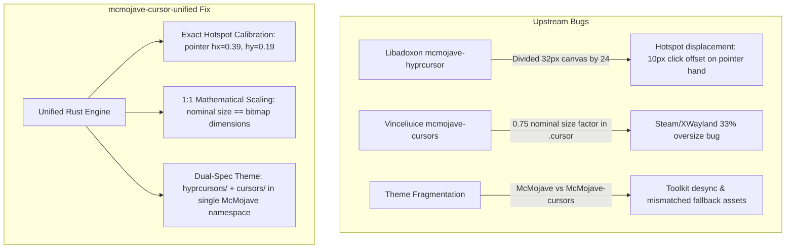

# MCMOJAVE-CURSOR-UNIFIED

[](LICENSE)
[](https://www.rust-lang.org/)
[](https://hyprland.org)
[](https://aur.archlinux.org/packages/mcmojave-cursor-unified)

A dual-spec, unified modern packaging of the **McMojave** macOS-inspired cursor theme for Linux desktops, combining native **Hyprcursor** (vector SVG) and mathematically calibrated **XCursor** (X11 / XWayland) into a single canonical directory with a blazing-fast native Rust compiler.

---

## 🎯 The Problems in Upstream Ports

While McMojave is one of the cleanest cursor designs for Linux, existing packages on GitHub and AUR suffer from critical mathematical flaws that break desktop ergonomics:



### 1. The 10-Pixel Pointer Hand Jump (Hotspot Bug)
In upstream Hyprcursor ports, hotspot coordinates were calculated by dividing raw coordinates by 24 instead of the actual 32×32 SVG canvas.
- For `pointer` (pointing hand), the index finger tip is at `(12.5, 6.0)`. Upstream configured `hotspot_x = 0.67` (16 / 24) instead of `0.39` (12.5 / 32).
- **Symptom:** When hovering over links or buttons, the click target visibly jumped ~10 pixels to the right, causing missed clicks and awkward selection behavior.
- **Fix:** Every cursor hotspot was mathematically recalculated and calibrated against the vector geometry.

### 2. The Steam / XWayland 33% Oversize Bug
Upstream XCursor builder scripts mapped 48px bitmaps to nominal size 36, and 32px bitmaps to nominal 24 (a `0.75` multiplier).
- **Symptom:** Whenever hovering over Steam, KeePassXC, Electron apps, or wine/games, the cursor was 33% larger than on native Wayland windows.
- **Fix:** Strict 1:1 nominal-to-pixel scaling (`24, 28, 32, 36, 40, 48, 64`) ensuring seamless visual consistency across Wayland and XWayland.

### 3. Toolkit Namespace Fragmentation
Upstream distributed Hyprcursor under `McMojave` and XCursor under `McMojave-cursors`.
- **Symptom:** Setting `XCURSOR_THEME="McMojave"` in X11/GTK apps loaded system fallback cursors (Adwaita) because `cursors/` was missing from `McMojave/`.
- **Fix:** Both specifications (`hyprcursors/` with `.hlc` archives and `cursors/` with X11 binary cursors + 64 legacy symlinks) reside in a single directory: `/usr/share/icons/McMojave`.

---

## 🧵 The Thread / O Fio da Meada

This repository was born out of an everyday desktop frustration: switching between native Wayland applications (running fluidly on Hyprland + Noctalia) and legacy XWayland / Steam games on Arch Linux / CachyOS, only to experience jarring cursor size mismatches and inaccurate click hotspots.

Tracing the issue through compositor logs, XSETTINGS daemons, and upstream source code revealed two distinct bugs that had persisted across the Linux cursor ecosystem:
1. An index finger hotspot offset in Hyprcursor vector metadata (`0.67` instead of `0.39`) caused by dividing coordinates by 24 instead of 32.
2. A hardcoded `0.75` nominal sizing multiplier in upstream XCursor scripts, forcing XWayland / Steam to render cursors 33% larger than native Wayland windows.

Rather than maintaining local patches or brittle shell scripts, this project unifies both specifications into a single canonical `McMojave` theme and provides a pure Rust 2024 compiler to build, calibrate, and package it with mathematical rigor.

---

## ⚡ Native Rust Compiler Engine

Instead of fragile legacy Bash scripts and Python wrappers, this repository includes an ultra-fast, multi-threaded builder written in **pure Rust (2024 edition)** using `rayon` and `zip`:

- **Parallel Vector Rasterization:** Parallel multi-scale generation (`24px` to `64px`) via `rsvg-convert`.
- **In-Memory .hlc Archive Generation:** Builds compliant Hyprcursor ZIP archives with clean `meta.hl` descriptors.
- **XCursor Generation:** Generates multi-size calibrated cursor binaries and creates full alias symlinks.
- **Sub-Second Build:** Compiles the entire dual-spec theme (47 base cursors, 64 symlinks, 7 resolutions) in under **1 second**.

---

## 🛠️ Installation

### Arch Linux (AUR)

Using your favorite AUR helper:

```bash
paru -S mcmojave-cursor-unified
# or
yay -S mcmojave-cursor-unified
```

### Build from Source

Requirements:
- `rust` (Cargo, 2024 edition compatible, Rust 1.85+)
- `librsvg` (`rsvg-convert`)
- `xorg-xcursorgen` (`xcursorgen`)

```bash
git clone https://github.com/ceduardorodrig/MCMOJAVE-CURSOR-UNIFIED.git
cd MCMOJAVE-CURSOR-UNIFIED
cargo run --release

# Install system-wide:
sudo mkdir -p /usr/share/icons/McMojave
sudo cp -r dist/McMojave/* /usr/share/icons/McMojave/
```

---

## ⚙️ Configuration Guide

To ensure consistent cursor rendering across all Wayland and X11 toolkits:

### 1. Hyprland & Wayland Session
In your Hyprland configuration or `~/.config/uwsm/env`:

```bash
export HYPRCURSOR_THEME="McMojave"
export HYPRCURSOR_SIZE=36
export XCURSOR_THEME="McMojave"
export XCURSOR_SIZE=36
```

### 2. GTK (2, 3, 4) & GNOME / GSettings
In `~/.config/gtk-3.0/settings.ini` (and GTK 4):

```ini
[Settings]
gtk-cursor-theme-name=McMojave
gtk-cursor-theme-size=36
```

Or via GSettings:
```bash
gsettings set org.gnome.desktop.interface cursor-theme 'McMojave'
gsettings set org.gnome.desktop.interface cursor-size 36
```

### 3. Qt (5 & 6)
In `~/.config/qt6ct/qt6ct.conf`:
```ini
[Appearance]
cursor=McMojave
cursor_size=36
```

### 4. Steam, Wine & Stubborn X11 Apps
Steam and older X11 applications read cursor settings via the **XSETTINGS** protocol and fall back to `~/.local/share/icons/default`.

1. **`xsettingsd` configuration** (`~/.config/xsettingsd/xsettingsd.conf`):
   ```ini
   Gtk/CursorThemeName "McMojave"
   Gtk/CursorThemeSize 36
   ```
   Run `xsettingsd` as a systemd user service.

2. **Xresources** (`~/.Xresources`):
   ```text
   Xcursor.theme: McMojave
   Xcursor.size: 36
   ```
   Apply with `xrdb -merge ~/.Xresources`.

3. **Steam Physical Fallback** (Steam sandbox does not follow symlinks):
   ```bash
   mkdir -p ~/.local/share/icons/default
   cp -r /usr/share/icons/McMojave/cursors ~/.local/share/icons/default/
   ```

---

## 📄 License

- Graphics and assets derived from [McMojave-cursors](https://github.com/vinceliuice/McMojave-cursors) by **Vinceliuice** (GPL-3.0).
- Compiler tooling and unified packaging: Copyright (C) 2026 **Carlos Eduardo Rodrigues** under **GPL-3.0-or-later** ([LICENSE](LICENSE)).

---

<div align="center">

> **Yes... This is a Vibe Coded project**
>
> Governed by 🤖 **StenioSentinel** (our Rust-based AI Governance Sentinel) with **Carlos Eduardo Rodrigues** ([@ceduardorodrig](https://github.com/ceduardorodrig)).

</div>
