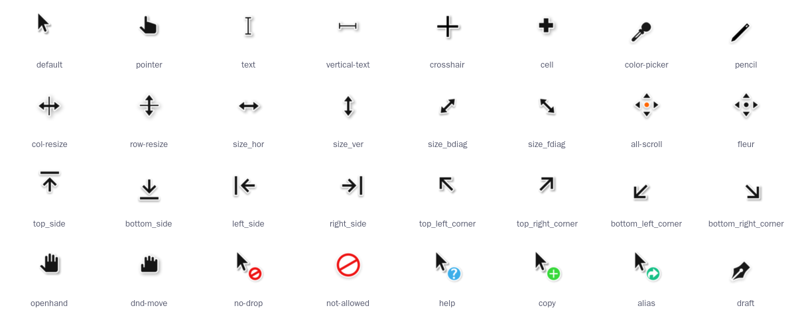
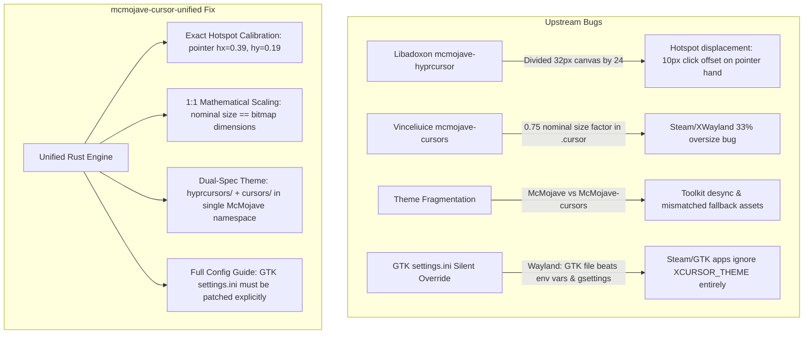

# MCMOJAVE-CURSOR-UNIFIED

[](LICENSE)
[](https://www.rust-lang.org/)
[](https://hyprland.org)

A dual-spec, unified modern packaging of the **McMojave** macOS-inspired cursor theme for Linux desktops, combining native **Hyprcursor** (vector SVG) and mathematically calibrated **XCursor** (X11 / XWayland) into a single canonical directory with a blazing-fast native Rust compiler (zero system dependencies).

---

## 🎨 Visual Showcase & Cursors

<div align="center">
  
</div>

### Animated Busy & Progress Cursors

| Cursor | Preview | Hotspot (X, Y) | Target & Legacy Aliases | Description |
| :--- | :---: | :---: | :--- | :--- |
| `wait` |  | `(0.50, 0.50)` | `watch` | 24-frame macOS spinning beachball for blocking app operations. |
| `progress` |  | `(0.16, 0.13)` | `half-busy`, `left_ptr_watch` | Primary pointer with spinning beachball for background activity. |

### Cursors by Category

<details open>
<summary><b>1. Pointers, Selection & Precision Tools</b></summary>

| Cursor | Icon | Hotspot | Aliases / Overrides | Description |
| :--- | :---: | :---: | :--- | :--- |
| `default` |  | `(0.16, 0.13)` | `arrow`, `left_ptr` | Standard macOS desktop arrow pointer. |
| `pointer` |  | `(0.39, 0.19)` | `hand1`, `hand2`, `pointing_hand` | Pointing hand (calibrated index fingertip hotspot). |
| `text` |  | `(0.47, 0.47)` | `ibeam`, `xterm` | Horizontal text selection I-beam. |
| `vertical-text` |  | `(0.47, 0.47)` | — | Vertical text editing beam. |
| `crosshair` |  | `(0.48, 0.48)` | `cross` | Precise coordinate crosshair selector. |
| `cell` |  | `(0.50, 0.50)` | `plus` | Table / spreadsheet cell selection cross. |
| `color-picker` |  | `(0.08, 0.91)` | — | Eyedropper tool for screen color sampling. |
| `pencil` |  | `(0.08, 0.91)` | — | Drawing and freehand annotation tool. |
| `draft` |  | `(0.08, 0.88)` | — | Precision compass / draft tool. |
| `help` |  | `(0.16, 0.13)` | `left_ptr_help`, `whats_this` | Pointer with contextual question mark badge. |

</details>

<details open>
<summary><b>2. Resizing & Moving</b></summary>

| Cursor | Icon | Hotspot | Aliases / Overrides | Description |
| :--- | :---: | :---: | :--- | :--- |
| `col-resize` |  | `(0.50, 0.50)` | `split_h` | Horizontal column divider resizing. |
| `row-resize` |  | `(0.50, 0.50)` | `split_v` | Vertical row divider resizing. |
| `size_hor` |  | `(0.50, 0.50)` | `e-resize`, `w-resize`, `h_double_arrow` | Window horizontal edge resizing. |
| `size_ver` |  | `(0.50, 0.50)` | `n-resize`, `s-resize`, `v_double_arrow` | Window vertical edge resizing. |
| `size_bdiag` |  | `(0.50, 0.50)` | `nesw-resize` | Diagonal resizing (SW to NE). |
| `size_fdiag` |  | `(0.50, 0.50)` | `nwse-resize` | Diagonal resizing (NW to SE). |
| `all-scroll` |  | `(0.50, 0.50)` | — | Four-way scrolling mode. |
| `fleur` |  | `(0.50, 0.50)` | `size_all` | Move / reposition window or canvas in all directions. |

</details>

<details open>
<summary><b>3. Window Border Handles & Directional Arrows</b></summary>

| Cursor | Icon | Hotspot | Aliases / Overrides | Description |
| :--- | :---: | :---: | :--- | :--- |
| `top_side` |  | `(0.50, 0.13)` | — | Top window border handle. |
| `bottom_side` |  | `(0.50, 0.84)` | — | Bottom window border handle. |
| `left_side` |  | `(0.13, 0.50)` | — | Left window border handle. |
| `right_side` |  | `(0.84, 0.50)` | — | Right window border handle. |
| `top_left_corner` |  | `(0.16, 0.13)` | `nw-resize`, `ul_angle` | Top-left corner window resize. |
| `top_right_corner` |  | `(0.84, 0.13)` | `ne-resize`, `ur_angle` | Top-right corner window resize. |
| `bottom_left_corner` |  | `(0.16, 0.84)` | `sw-resize`, `ll_angle` | Bottom-left corner window resize. |
| `bottom_right_corner` |  | `(0.84, 0.84)` | `se-resize`, `lr_angle` | Bottom-right corner window resize. |

</details>

<details open>
<summary><b>4. Drag & Drop, Feedback & Zoom</b></summary>

| Cursor | Icon | Hotspot | Aliases / Overrides | Description |
| :--- | :---: | :---: | :--- | :--- |
| `openhand` |  | `(0.50, 0.50)` | `grab` | Open hand for grabbing objects or panning canvas. |
| `dnd-move` |  | `(0.50, 0.50)` | `closedhand`, `grabbing`, `move` | Closed hand actively grabbing / dragging. |
| `copy` |  | `(0.16, 0.13)` | `dnd-copy` | Dragging with duplication / copy badge (+). |
| `alias` |  | `(0.16, 0.13)` | `link` | Dragging to create a shortcut / link arrow badge. |
| `not-allowed` |  | `(0.50, 0.50)` | `circle`, `crossed_circle` | Prohibited action or unavailable target. |
| `no-drop` |  | `(0.16, 0.13)` | `forbidden` | Pointer indicating item cannot be dropped here. |
| `zoom-in` |  | `(0.50, 0.50)` | — | Magnifying glass with plus (+) to zoom in. |
| `zoom-out` |  | `(0.50, 0.50)` | — | Magnifying glass with minus (-) to zoom out. |

</details>

---

## 🎯 The Problems in Upstream Ports

While McMojave is one of the cleanest cursor designs for Linux, existing packages on GitHub suffer from critical mathematical flaws that break desktop ergonomics:


```mermaid
flowchart TD
    subgraph Upstream Bugs
        A1[Libadoxon mcmojave-hyprcursor] -->|Divided 32px canvas by 24| B1[Hotspot displacement: 10px click offset on pointer hand]
        A2[Vinceliuice mcmojave-cursors] -->|0.75 nominal size factor in .cursor| B2[Steam/XWayland 33% oversize bug]
        A3[Theme Fragmentation] -->|McMojave vs McMojave-cursors| B3[Toolkit desync & mismatched fallback assets]
        A4[GTK settings.ini Silent Override] -->|Wayland: GTK file beats env vars & gsettings| B4[Steam/GTK apps ignore XCURSOR_THEME entirely]
    end

    subgraph mcmojave-cursor-unified Fix
        C[Unified Rust Engine] --> D1[Exact Hotspot Calibration: pointer hx=0.39, hy=0.19]
        C --> D2[1:1 Mathematical Scaling: nominal size == bitmap dimensions]
        C --> D3[Dual-Spec Theme: hyprcursors/ + cursors/ in single McMojave namespace]
        C --> D4[Full Config Guide: GTK settings.ini must be patched explicitly]
    end
```

### 1. The 10-Pixel Pointer Hand Jump (Hotspot Bug)
In upstream Hyprcursor ports, hotspot coordinates were calculated by dividing raw coordinates by 24 instead of the actual 32×32 SVG canvas.
- For `pointer` (pointing hand), the index finger tip is at `(12.5, 6.0)`. Upstream configured `hotspot_x = 0.67` (16 / 24) instead of `0.39` (12.5 / 32).
- **Symptom:** When hovering over links or buttons, the click target visibly jumped ~10 pixels to the right, causing missed clicks and awkward selection behavior.
- **Fix:** Every cursor hotspot was mathematically recalculated and calibrated against the vector geometry.

### 2. The Steam / XWayland 33% Oversize Bug
Upstream XCursor builder scripts mapped 48px bitmaps to nominal size 36, and 32px bitmaps to nominal 24 (a `0.75` multiplier).
- **Symptom:** Whenever hovering over Steam, KeePassXC, Electron apps, or wine/games, the cursor was 33% larger than on native Wayland windows.
- **Fix:** Strict 1:1 nominal-to-pixel scaling (`24, 28, 32, 36, 40, 48, 64`) ensuring seamless visual consistency across Wayland and XWayland.

### 3. Toolkit Namespace Fragmentation
Upstream distributed Hyprcursor under `McMojave` and XCursor under `McMojave-cursors`.
- **Symptom:** Setting `XCURSOR_THEME="McMojave"` in X11/GTK apps loaded system fallback cursors (Adwaita) because `cursors/` was missing from `McMojave/`.
- **Fix:** Both specifications (`hyprcursors/` with `.hlc` archives and `cursors/` with X11 binary cursors + 64 legacy symlinks) reside in a single directory: `/usr/share/icons/McMojave`.

### 4. The GTK `settings.ini` Silent Override (Wayland-Only)
On Wayland sessions, GTK applications (including Steam) resolve the cursor theme by reading `~/.config/gtk-3.0/settings.ini` and `~/.config/gtk-4.0/settings.ini` **directly**, bypassing `XCURSOR_THEME`, `gsettings`, and `~/.icons/default` entirely.
- **Symptom:** Even with `XCURSOR_THEME=McMojave` in the environment, `gsettings` pointing to `McMojave`, and `/usr/share/icons/default` correctly inheriting `McMojave` — Steam and all GTK apps stubbornly render a different cursor (e.g. `Bibata-Modern-Classic`) because it was set in `settings.ini` by a theme manager and never updated.
- **Root cause:** On Wayland there is no XSETTINGS daemon bridge; GTK reads its own INI files as the authoritative source for cursor configuration. Environment variables and gsettings are only consulted as fallbacks when `settings.ini` is absent or does not specify the key.
- **Fix:** Both `gtk-3.0` and `gtk-4.0` `settings.ini` must explicitly declare:
  ```ini
  gtk-cursor-theme-name=McMojave
  gtk-cursor-theme-size=36
  ```
  See the [Configuration Guide → GTK section](#2-gtk-2-3-4--gnome--gsettings) below. After editing, restart the affected application — no logout required.

---

## 🧵 The Thread

This repository was born out of an everyday desktop frustration: switching between native Wayland applications (running fluidly on Hyprland + Noctalia) and legacy XWayland / Steam games on Arch Linux / CachyOS, only to experience jarring cursor size mismatches and inaccurate click hotspots.

Tracing the issue through compositor logs, XSETTINGS daemons, GTK configuration files, and upstream source code revealed four distinct bugs that had persisted across the Linux cursor ecosystem:
1. An index finger hotspot offset in Hyprcursor vector metadata (`0.67` instead of `0.39`) caused by dividing coordinates by 24 instead of 32.
2. A hardcoded `0.75` nominal sizing multiplier in upstream XCursor scripts, forcing XWayland / Steam to render cursors 33% larger than native Wayland windows.
3. Theme namespace fragmentation between `McMojave` (Hyprcursor) and `McMojave-cursors` (XCursor), causing GTK/X11 apps to fall back to system defaults.
4. On Wayland, GTK `settings.ini` files (`gtk-3.0` / `gtk-4.0`) take authoritative precedence over `XCURSOR_THEME` and `gsettings`, silently overriding the cursor even when all other layers are correctly configured — causing apps like Steam to display a stale cursor set by a theme manager.

Rather than maintaining local patches or brittle shell scripts, this project unifies both specifications into a single canonical `McMojave` theme and provides a pure Rust 2024 compiler to build, calibrate, and package it with mathematical rigor.

---

## ⚡ Native Rust Compiler Engine

Instead of fragile legacy Bash scripts and Python wrappers, this repository includes an ultra-fast, multi-threaded builder written in **pure Rust (2024 edition)** — with **zero system dependencies**:

- **Native SVG Rasterization:** [`resvg`](https://crates.io/crates/resvg) renders SVGs in-process via `tiny-skia`, parallel across all 7 resolutions (`24px` to `64px`) — no `rsvg-convert`, no forks, no `librsvg` required.
- **Native XCursor Encoder:** Pure Rust binary encoder writes the XCursor format directly (ARGB pixel layout, multi-size TOC, animated frame support) — no `xcursorgen`, no `xorg-xcursorgen` required.
- **In-Memory .hlc Archive Generation:** Builds compliant Hyprcursor ZIP archives with clean `meta.hl` descriptors via `rayon` + `zip`.
- **mtime-aware Cache:** Re-rasterizes only SVGs newer than their cached PNG — incremental rebuilds are instant.
- **Sub-Second Build:** Compiles the entire dual-spec theme (47 base cursors, 64 symlinks, 7 resolutions) in under **1 second**.

---

## 🛠️ Installation

### Build & Install from Source

**Requirements:** `rust` (Cargo, 2024 edition, Rust 1.85+) — nothing else.

```bash
git clone https://github.com/ceduardorodrig/MCMOJAVE-CURSOR-UNIFIED.git
cd MCMOJAVE-CURSOR-UNIFIED

# Build + install to /usr/share/icons/McMojave/ + apply to all config layers:
cargo run --release -- --install
```

That's it. `--install` handles everything in one command:
1. Builds the theme (`hyprcursors/` + calibrated `cursors/`)
2. Copies to `/usr/share/icons/McMojave/` (via `sudo`)
3. Applies McMojave to all toolkit layers (GTK 3/4, gsettings, Qt, Wayland env, etc.)

**Other useful commands:**
```bash
# Re-apply all config layers without rebuilding (e.g. after a theme manager reset):
./target/release/mcmojave-cursor-unified --apply-only

# Build only (output to dist/McMojave):
cargo run --release

# Rebuild from scratch:
cargo run --release -- --clean
```

---

## ⚙️ Configuration Guide

> **TL;DR:** `cargo run --release -- --install` configures everything automatically.
> The sections below are for reference or manual overrides only.

`--install` (and `--apply-only`) automatically writes McMojave to **all** of these layers:

| Layer | File / Command |
|---|---|
| Wayland session env | `~/.config/uwsm/env` (`HYPRCURSOR_THEME`, `XCURSOR_THEME`) |
| GTK 3 | `~/.config/gtk-3.0/settings.ini` |
| GTK 4 | `~/.config/gtk-4.0/settings.ini` |
| GTK 2 | `~/.gtkrc-2.0` |
| GSettings | `org.gnome.desktop.interface cursor-theme` |
| xsettingsd | `~/.config/xsettingsd/xsettingsd.conf` |
| X11 fallback | `~/.icons/default/index.theme` |
| System fallback | `/usr/share/icons/default/index.theme` (via sudo) |
| Qt 5/6 | `~/.config/qt5ct/qt5ct.conf`, `~/.config/qt6ct/qt6ct.conf` |

---

### Manual Configuration (reference)

If you prefer to configure layers individually:

#### Hyprland / Wayland session (`~/.config/uwsm/env` or hyprland.conf):
```bash
export HYPRCURSOR_THEME="McMojave"
export HYPRCURSOR_SIZE=36
export XCURSOR_THEME="McMojave"
export XCURSOR_SIZE=36
```

#### GTK 3 & 4 (`~/.config/gtk-{3,4}.0/settings.ini`):

> **⚠️ Wayland Priority Warning:** On Wayland, GTK reads `settings.ini` as the **authoritative source**, overriding `XCURSOR_THEME` and even `gsettings`. If a theme manager (nwg-look, GNOME Tweaks, etc.) previously set a different cursor here, it silently wins. **Always verify `settings.ini` explicitly** — or just run `--apply-only` after any theme manager change.

```ini
[Settings]
gtk-cursor-theme-name=McMojave
gtk-cursor-theme-size=36
```

#### GSettings (fallback — only if `settings.ini` does not set the key):
```bash
gsettings set org.gnome.desktop.interface cursor-theme 'McMojave'
gsettings set org.gnome.desktop.interface cursor-size 36
```

#### Qt 5 & 6 (`~/.config/qt6ct/qt6ct.conf`):
```ini
[Appearance]
cursor=McMojave
cursor_size=36
```

#### Steam / Wine / stubborn X11 apps (xsettingsd):
```ini
# ~/.config/xsettingsd/xsettingsd.conf
Gtk/CursorThemeName "McMojave"
Gtk/CursorThemeSize 36
```

#### Xresources (legacy X11):
```text
Xcursor.theme: McMojave
Xcursor.size: 36
```
Apply with `xrdb -merge ~/.Xresources`.

---

## 📄 License

- Graphics and assets derived from [McMojave-cursors](https://github.com/vinceliuice/McMojave-cursors) by **Vinceliuice** (GPL-3.0).
- Compiler tooling and unified packaging: Copyright (C) 2026 **Carlos Eduardo Rodrigues** under **GPL-3.0-or-later** ([LICENSE](LICENSE)).

---

<div align="center">

> **Yes... This is a Vibe Coded project**
>
> Governed by 🤖 **StenioSentinel** (our Rust-based AI Governance Sentinel) with **Carlos Eduardo Rodrigues** ([@ceduardorodrig](https://github.com/ceduardorodrig)).

</div>
